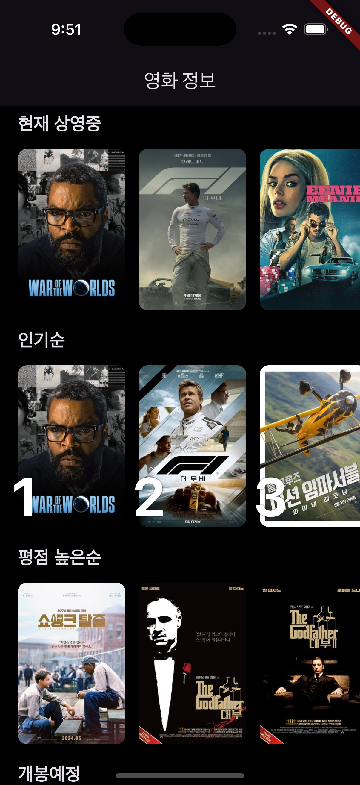
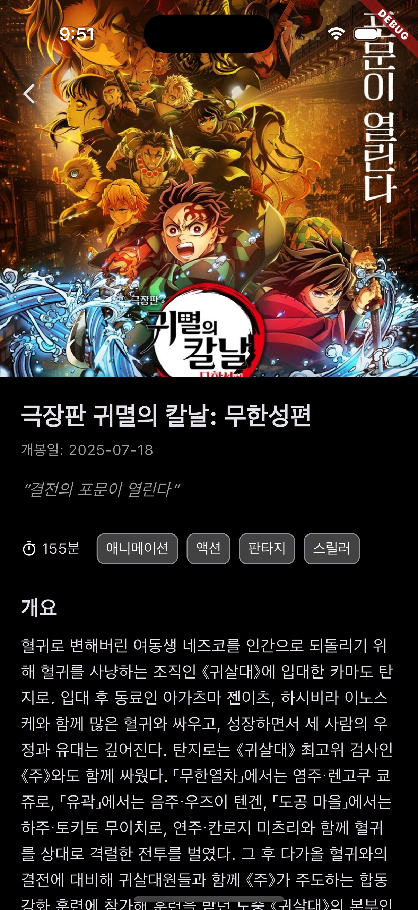

# 영화 정보 앱 (Flutter Movie App)

TMDB API를 활용하여 제작한 Flutter 영화 정보 애플리케이션입니다. 클린 아키텍처와 MVVM 패턴을 적용하여 확장 가능하고 유지보수가 용이한 구조로 설계되었습니다.

## 주요 기능

- **홈 화면**: 현재 상영중, 인기순, 평점 높은순, 개봉 예정 영화 목록을 섹션별로 제공합니다.
- **상세 화면**: 영화 포스터, 개요, 평점, 제작사 등 상세 정보를 확인할 수 있습니다.
- **부드러운 화면 전환**: Hero 애니메이션을 적용하여 목록과 상세 화면 간의 자연스러운 시각적 전환을 제공합니다.
- **상태 관리**: 로딩, 데이터 표시, 에러 상황에 대한 UI를 명확하게 분리하였습니다.

## 프로젝트 구조

```plaintext
movie_info/
├── lib/
│   ├── data/                 # 데이터 계층: API, DB 등 데이터 소스 관리
│   │   ├── data_source/
│   │   │   ├── movie_data_source.dart         # DataSource의 인터페이스(규칙) 정의
│   │   │   └── movie_data_source_impl.dart    # TMDB API 통신 구현체
│   │   ├── dto/
│   │   │   ├── movie_detail_dto.dart          # 상세 페이지 API 응답용 데이터 모델
│   │   │   └── movie_response_dto.dart        # 영화 목록 API 응답용 데이터 모델
│   │   ├── mapper/
│   │   │   └── movie_mapper.dart              # DTO를 Domain 모델로 변환하는 로직
│   │   └── repository/
│   │       └── movie_repository_impl.dart     # Domain 계층의 Repository 인터페이스 구현체
│   │
│   ├── domain/               # 도메인 계층: 앱의 핵심 비즈니스 로직
│   │   ├── model/
│   │   │   ├── movie.dart                     # 앱에서 사용할 핵심 영화 모델
│   │   │   └── movie_detail.dart              # 앱에서 사용할 상세 정보 모델
│   │   ├── repository/
│   │   │   └── movie_repository.dart          # 데이터 계층이 따라야 할 규칙 정의
│   │   └── use_case/
│   │       ├── get_home_data_use_case.dart    # 홈 화면에 필요한 데이터를 가져오는 로직
│   │       └── get_movie_detail_use_case.dart # 상세 화면 데이터를 가져오는 로직
│   │
│   └── presentation/         # 표현 계층: UI와 상태 관리
│       ├── detail/
│       │   ├── detail_page.dart               # 상세 화면 UI (View)
│       │   └── detail_view_model.dart         # 상세 화면 상태 및 로직 (ViewModel)
│       └── home/
│           ├── home_page.dart                 # 홈 화면 UI (View)
│           └── home_view_model.dart           # 홈 화면 상태 및 로직 (ViewModel)
│
├── .env                      # API 토큰 등 환경 변수 설정 파일
└── main.dart                 # 앱 시작점 및 의존성 주입(DI) 설정
```

## 스크린샷

<table>
  <thead>
    <tr>
      <th align="center">주요 화면</th>
    </tr>
  </thead>
  <tbody>
    <tr>
      <td>
        <div style="display: flex; justify-content: center; gap: 10px;">
          
          
        </div>
      </td>
    </tr>
  </tbody>
</table>


## 아키텍처

이 프로젝트는 **클린 아키텍처(Clean Architecture)**를 기반으로 설계되었으며, **MVVM(Model-View-ViewModel)** 패턴을 UI 계층에 적용했습니다.

-   **Presentation Layer**: UI(View)와 UI의 상태 및 로직(ViewModel)을 담당합니다.
    -   **View**: `HomePage`, `DetailPage` 등 UI를 그리는 역할에 집중합니다.
    -   **ViewModel**: `HomeViewModel`, `DetailViewModel` 등 View에 필요한 데이터를 가공하고, 비즈니스 로직 실행을 UseCase에 위임합니다.
-   **Domain Layer**: 앱의 핵심 비즈니스 로직을 포함합니다.
    -   **Model**: `Movie`, `MovieDetail` 등 순수한 데이터 모델을 정의합니다.
    -   **UseCase**: `GetHomeDataUseCase` 등 단일 책임을 갖는 비즈니스 로직을 정의합니다.
    -   **Repository (Interface)**: 데이터 계층이 구현해야 할 명세를 정의합니다.
-   **Data Layer**: 데이터의 출처(네트워크, DB 등)를 관리합니다.
    -   **Repository (Implementation)**: Domain 계층의 Repository 인터페이스를 구현합니다.
    -   **DataSource**: TMDB API와의 통신 등 실제 데이터 소스를 다룹니다.
    -   **DTO/Mapper**: 네트워크 통신을 위한 데이터 전송 객체(DTO)와 이를 Domain 모델로 변환하는 Mapper를 포함합니다.

의존성 주입(DI)과 상태 관리는 `provider` 패키지를 활용합니다.

## 실행 방법

### 1. 프로젝트 복제

```bash
git clone https://github.com/your-username/movie_info.git
cd movie_info
```

### 2. 환경 변수 설정

프로젝트 루트 디렉토리에 `.env` 파일을 생성하고, TMDB에서 발급받은 API Access Token을 추가합니다.

```
TMDB_API_TOKEN="여기에_발급받은_토큰을_입력하세요"
```

> **참고**: TMDB API Access Token은 TMDB 공식 홈페이지의 'API' > 'API Read Access Token (v4 auth)' 섹션에서 발급받을 수 있습니다.

### 3. 의존성 설치

```bash
flutter pub get
```

### 4. 앱 실행

```bash
flutter run
```

## 사용된 주요 기술 및 라이브러리

-   **Flutter**: 크로스플랫폼 UI 프레임워크
-   **Provider**: 상태 관리 및 의존성 주입
-   **http**: 네트워크 통신
-   **flutter_dotenv**: 환경 변수 관리
-   **intl**: 숫자 및 날짜 포맷팅

